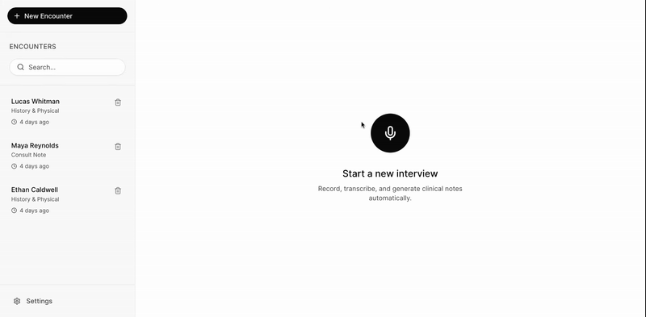

<div align="center">


# OpenScribe

Open-source AI medical scribe for recording encounters and generating structured clinical notes.

<p>
  <a href="https://github.com/sammargolis/OpenScribe/blob/main/LICENSE">
    
  </a>
  <a href="https://discord.gg/BcNNspcNE8">
    
  </a>
  <a href="https://www.loom.com/share/1ccd4eec00eb4ddab700d32734f33c28">
    
  </a>
</p>

</div>


## Project Overview

OpenScribe is a free, MIT-licensed, open-source AI medical scribe that helps clinicians record patient encounters, transcribe audio, and generate structured draft clinical notes using LLMs. The default web deployment path is mixed mode: local Whisper transcription + Anthropic Claude note generation. A fully local desktop path is also available, forked from [StenoAI](https://github.com/ruzin/stenoai).

- [Demo](https://www.loom.com/share/1ccd4eec00eb4ddab700d32734f33c28)
- [Architecture](./architecture.md)
- [Contributing](./CONTRIBUTING.md)
- [Download and Use Desktop](./docs/DOWNLOAD_AND_USE.md)
- [Desktop Release Runbook](./docs/RELEASE_RUNBOOK.md)

OpenScribe is not HIPAA compliant yet. The team is actively working toward HIPAA compliance.

## Demo

[Demo](https://www.loom.com/share/1ccd4eec00eb4ddab700d32734f33c28)

[](https://www.loom.com/share/1ccd4eec00eb4ddab700d32734f33c28)


## Star History

<a href="https://www.star-history.com/?repos=Open-scribe%2FOpenScribe&type=timeline&legend=top-left">
 <picture>
   <source media="(prefers-color-scheme: dark)" srcset="https://api.star-history.com/image?repos=Open-scribe/OpenScribe&type=timeline&theme=dark&legend=top-left" />
   <source media="(prefers-color-scheme: light)" srcset="https://api.star-history.com/image?repos=Open-scribe/OpenScribe&type=timeline&legend=top-left" />
   
 </picture>
</a>


## Download Desktop App (No Dev Setup)

If you only want to try OpenScribe as an app:

1. Open [latest releases](https://github.com/sammargolis/OpenScribe/releases/latest).
2. Download the installer for your OS/arch.
3. Run installer and complete first-run setup wizard.

Full guide: [docs/DOWNLOAD_AND_USE.md](./docs/DOWNLOAD_AND_USE.md)


## Quick Start (5 minutes)

### 1. Install Prerequisites

```bash
node --version  # Check you have Node.js 18+
# If not installed (macOS): brew install node
# If installed but <18 (macOS): brew upgrade node
npm install -g pnpm
```

### 2. Clone and Install

```bash
git clone https://github.com/sammargolis/OpenScribe.git
cd OpenScribe
pnpm install
```

### 3. Configure Environment (Mixed Web Default)

Create env defaults:

```bash
pnpm run setup  # Auto-generates .env.local with secure storage key
```

Edit `apps/web/.env.local` and add:

```bash
TRANSCRIPTION_PROVIDER=whisper_local
WHISPER_LOCAL_MODEL=tiny.en
ANTHROPIC_API_KEY=sk-ant-YOUR_KEY_HERE
# NEXT_PUBLIC_SECURE_STORAGE_KEY is auto-generated, don't modify
```

`OPENAI_API_KEY` is optional unless you switch to `TRANSCRIPTION_PROVIDER=whisper_openai`.

### 4. Start the App

```bash
pnpm dev:local    # One command: Whisper local server + web app
```

Optional desktop app path:

```bash
pnpm electron:dev
```

Desktop production builds:

```bash
pnpm build:desktop:mac
pnpm build:desktop:win
pnpm build:desktop:linux
# or
pnpm build:desktop:all
```

GA support target for packaged desktop releases:
- macOS (mainstream current) `x64`, `arm64`
- Windows (mainstream current) `x64`
- Linux (mainstream current desktop distros) `x64`, `arm64`
- Recommended minimum: 8GB RAM, 20GB free disk

See release gate details in [docs/RELEASE_READINESS_CHECKLIST.md](./docs/RELEASE_READINESS_CHECKLIST.md).
Manual reviewer sign-off template: [docs/MANUAL_SIGNOFF_TEMPLATE.md](./docs/MANUAL_SIGNOFF_TEMPLATE.md).

## Quick Start (Docker)

SAM is the easiest way to run OpenScribe for new contributors: one command starts the web app and local Whisper transcription service.

### 1. Create SAM env file

```bash
pnpm run setup
```

Edit `apps/web/.env.local` and set:

```bash
ANTHROPIC_API_KEY=sk-ant-YOUR_KEY_HERE
```

### 2. Start SAM

```bash
docker compose -f docker-compose.sam.yml up --build
```

### 3. Open the app

```bash
http://localhost:3001
```

### 4. Verify Whisper health (optional)

```bash
curl http://127.0.0.1:8002/health
```

---

## Runtime Modes

OpenScribe supports three workflows. **Mixed web mode is the default path.**

### Mixed Web (default)
- Transcription: local Whisper server (`pnpm whisper:server`) with default model `tiny.en`
- Notes: larger model (default Claude in web path)
- Start everything with one command: `pnpm dev:local`
- Configure with `TRANSCRIPTION_PROVIDER=whisper_local` in `apps/web/.env.local`
- [Setup guide](./docs/WHISPER-LOCAL-SETUP.md)
- [Troubleshooting `WHISPER_UNHEALTHY` and model-download failures](./docs/WHISPER-TROUBLESHOOTING.md)

**Language support**
- Default model `tiny.en` as well as all `.en`-models transcribes English only
- Multilingual transcription works for both local and API-based models
- Multilingual transcription is supported by setting `WHISPER_LANGUAGE` (see `.env.local.example` for details) and (for local use) switching to a non-`.en` Whisper model (e.g. `tiny`, `base`, `small`)
- Users can also pick the language in the app: `Settings -> Transcription Language`. An explicit choice overrides `WHISPER_LANGUAGE`; leaving it on `Auto (default)` keeps the existing env/auto-detect behavior unchanged. [Precedence rules and details](./docs/TRANSCRIPTION-LANGUAGE.md)

### Local-only Desktop (optional)
- Transcription: local Whisper backend in `local-only/openscribe-backend`
- Notes: local Ollama models (`llama3.2:*`, `gemma3:4b`)
- No cloud inference in this path
- First-run desktop setup wizard guides Whisper/model downloads
- [Setup guide](./local-only/README.md)

### Cloud/OpenAI + Claude (fallback)
- Transcription: OpenAI Whisper API
- Notes: Anthropic Claude (or other hosted LLM)
- Requires API keys in `apps/web/.env.local`

### OpenClaw + OpenEMR Demo Handoff (desktop)
- The note editor now includes `Send to OpenClaw` (desktop app path).
- Trigger flow: record encounter -> note appears -> click `Send to OpenClaw`.
- OpenScribe sends patient/note context to OpenClaw and requests an OpenEMR note action.

Optional environment variables for demos:

```bash
# OpenClaw CLI (default: openclaw on PATH)
OPENCLAW_BIN=openclaw

# Target OpenClaw agent/session (default: main)
OPENCLAW_AGENT=main

# If set to 1, OpenClaw can deliver responses to a configured channel
OPENCLAW_DELIVER=0

# Optional webhook transport instead of CLI
# OPENCLAW_DEMO_WEBHOOK_URL=http://127.0.0.1:8787/openscribe/handoff
# OPENCLAW_DEMO_WEBHOOK_TOKEN=your-token
```

### FYI Getting API Keys

**OpenAI** (transcription): [platform.openai.com/api-keys](https://platform.openai.com/api-keys) - Sign up → API Keys → Create new secret key

**Anthropic** (note generation): [console.anthropic.com/settings/keys](https://console.anthropic.com/settings/keys) - Sign up → API Keys → Create Key

Both services offer $5 free credits for new accounts

### Staying Updated

```bash
git pull origin main  # Pull latest changes
pnpm install          # Update dependencies

# If you encounter issues after updating:
rm -rf node_modules pnpm-lock.yaml && pnpm install
```

---

## Note Templates

A note template is the markdown skeleton the model fills in. Pick one in
**Settings → Note Template**; the choice is stored locally and applies to every
new encounter.

| Option | What you get |
| --- | --- |
| **Default** | History and Physical: Chief Complaint, HPI, Review of Systems, Past Medical History, Medications |
| **SOAP** | Subjective (CC / HPI / ROS), Objective (Physical Examination), Assessment, Plan |
| **Custom** | Your own markdown, edited in the Settings text area |

Presets live in `packages/llm/src/prompts/clinical-note/templates/index.ts`. The
custom template stays on your device, in the same local preferences store as
note length and processing mode.

### Writing a custom template

Use markdown ATX headings to define the structure:

- `#` — the note title (one per template, e.g. `# Cardiology Follow-Up`)
- `##` — a section; each one is parsed as a separate note section
- `###` — a subsection, kept inside its parent section

```markdown
# Cardiology Follow-Up

## Reason for Visit

## Interval History

## Medications
### Cardiac
### Other

## Assessment and Plan
```

Section names are free text, so add specialty sections and drop the ones you do
not use. Content under a heading is optional — the model fills sections from the
transcript and omits what the transcript does not support.

A custom template must be non-empty and contain at least one markdown heading.
If it is blank or heading-less, note generation logs a warning and falls back to
the Default template instead of failing.

Selecting **Default** keeps the existing behavior where a visit type of
"problem visit" maps to the SOAP structure. Choosing **SOAP** or **Custom**
overrides the visit type for every encounter.

---

## Purpose and Philosophy

OpenScribe exists to provide a simple, open-source alternative to cloud dependent clinical documentation tools. The project is built on core principles:

- **Local-first storage**: Encounter data is stored locally in the browser by default
- **Privacy-conscious**: No analytics or telemetry in the web app; external model calls are explicit and configurable
- **Modular**: Components can be swapped or extended (e.g., different LLM providers, transcription services)

## Local MedGemma (Text-Only) Scribe

This repo now includes a fully local, **text-only** MedGemma scribe workflow in
`packages/pipeline/medgemma-scribe`. It requires **pre-transcribed text** and
does not perform speech-to-text. See
`packages/pipeline/medgemma-scribe/README.md` for setup and usage.

## Project Resources

- **GitHub**: [sammargolis/OpenScribe](https://github.com/sammargolis/OpenScribe)
- **Maintainer**: [@sammargolis](https://github.com/sammargolis)
- **Architecture**: [architecture.md](./architecture.md)
- **Tests**: [packages/llm](./packages/llm/src/__tests__/), [packages/pipeline](./packages/pipeline/)

## Roadmap

### Current Status (v0)
- Core recording, transcription, and note generation
- AES-GCM encrypted local storage
- Browser-based audio capture

### Near-term (v0.1-0.5)
- Error handling improvements
- Comprehensive test coverage
- Basic audit logging

**Physical Controls**:
- User responsibility (device security, physical access)

### Future Goals (v2.0+)
- Package app to be able to run 100% locally with transcription model and small 7b model for note generation
- Multiple LLM providers (Anthropic, local models)
- Custom note templates
- Optional cloud sync (user-controlled)
- Multi-language support
- Mobile app
- EHR integration
- RCM integration

## Architecture

See [architecture.md](./architecture.md) for complete details.

```
┌─────────────────────────────────────────────────────────┐
│                    UI Layer (Next.js)                   │
│  ┌──────────────┐              ┌─────────────────────┐  │
│  │ Encounter    │              │  Workflow States    │  │
│  │ Sidebar      │◄────────────►│  - Idle             │  │
│  │              │              │  - Recording        │  │
│  │              │              │  - Processing       │  │
│  │              │              │  - Note Editor      │  │
│  └──────────────┘              └─────────────────────┘  │
└─────────────────────────────────────────────────────────┘
                          │
                          ▼
┌─────────────────────────────────────────────────────────┐
│              Processing Pipeline                        │
│  ┌──────────┐   ┌──────────┐   ┌──────────┐   ┌─────┐   │
│  │  Audio   │──►│Transcribe│──►│   LLM    │──►│Note │   │
│  │  Ingest  │   │ (Whisper)│   │          │   │Core │   │
│  └──────────┘   └──────────┘   └──────────┘   └─────┘   │
│       │                                           │     │
│       └───────────────┐         ┌─────────────────┘     │
└───────────────────────┼─────────┼───────────────────────┘
                        ▼         ▼
┌─────────────────────────────────────────────────────────┐
│                  Storage Layer                          │
│  ┌──────────────────────────────────────────────────┐   │
│  │  Encrypted LocalStorage (AES-GCM)                │   │
│  │  - Encounters (patient data, transcripts, notes) │   │
│  │  - Metadata (timestamps, status)                 │   │
│  │  - Audio (in-memory only, not persisted)         │   │
│  └──────────────────────────────────────────────────┘   │
└─────────────────────────────────────────────────────────┘
```

**Key Components:**
- **UI Layer**: React components in `apps/web/` using Next.js App Router
- **Audio Ingest**: Browser MediaRecorder API → WebM/MP4 blob
- **Transcription (default web path)**: local Whisper server (`whisper.cpp` via `pywhispercpp`, model `tiny.en`)
- **LLM (default web path)**: Anthropic Claude via `packages/llm`
- **Fully local desktop path**: Whisper + Ollama via `local-only/openscribe-backend`
- **Cloud fallback path**: OpenAI Whisper API + hosted provider via `packages/llm`
- **Note Core**: Structured clinical note generation and validation
- **Storage**: AES-GCM encrypted browser localStorage

**Monorepo Structure:**
- `apps/web/` – Next.js frontend + Electron renderer
- `packages/pipeline/` – Audio ingest, transcription, assembly, evaluation
- `packages/ui/` – Shared React components
- `packages/storage/` – Encrypted storage + encounter management
- `packages/llm/` – Provider-agnostic LLM client
- `packages/shell/` – Electron main process
- `config/` – Shared configuration files
- `build/` – Build artifacts

## Privacy & Data Handling

**Storage**: AES-GCM encrypted localStorage. Audio processed in-memory, not persisted.  
**Transmission**: In the default mixed mode, audio stays local for transcription and transcript text is sent to Anthropic Claude over HTTPS/TLS for note generation. If `TRANSCRIPTION_PROVIDER=whisper_openai`, audio is sent to OpenAI Whisper over HTTPS/TLS. The application enforces HTTPS-only connections and displays a security warning if accessed over HTTP in production builds.  
**No Tracking**: Zero analytics, telemetry, or cloud sync

**Use Responsibility**  
- All AI notes are drafts requiring review
- Ensure regulatory compliance for your use case
- For production deployments serving PHI, ensure the application is accessed via HTTPS or served from localhost only

## Limitations & Disclaimers
 
**HIPAA Compliance**: OpenScribe includes foundational privacy/security features, but this alone does not make the application HIPAA-compliant. Below is what is already built, followed by a checklist a health system must complete to operate compliantly.

**Built (foundational rails)**
- AES-GCM encrypted localStorage for PHI at rest in the browser
- Audio processed in-memory and not persisted
- TLS/HTTPS for external API calls (Whisper, Claude)
- No analytics/telemetry or cloud sync by default (local-first)
- HTTPS-only enforcement in production with HTTP warning

**Health System Checklist (required to run compliantly)**
- Execute BAAs with all PHI-touching vendors (e.g., OpenAI, Anthropic, hosting providers)
- Perform and document HIPAA Security Rule risk analysis and remediation plan
- Implement access controls (SSO/MFA, least-privilege, session timeouts)
- Establish audit logging, log review processes, and retention policies
- Define data retention, backup, and secure deletion procedures for PHI
- Configure device, endpoint, and physical safeguards (disk encryption, MDM, secure workstations)
- Document policies and procedures (incident response, breach notification, sanctions)
- Train workforce on HIPAA/privacy/security requirements
- Establish key management and secret rotation procedures
- Validate network/security posture (secure deployment, vulnerability management)

**No EHR Integration**: Standalone tool  
**Browser Storage Limits**: ~5-10MB typical  
**No Warranty**: Provided as-is under MIT License

## Contributing

Contributions welcome! See [CONTRIBUTING.md](./CONTRIBUTING.md) for detailed guidelines.

**Quick Start:**
1. Fork the repository
2. Create a feature branch
3. Make changes with tests
4. Submit a PR

## Notices

Portions of this project include or were derived from code in:

**StenoAI** – https://github.com/ruzin/stenoai  
Copyright (c) 2025 Skrape Limited  
Licensed under the MIT License.

All third-party code remains subject to its original license terms.


## License

MIT

```
MIT License

Copyright (c) 2026 Sam Margolis

Permission is hereby granted, free of charge, to any person obtaining a copy
of this software and associated documentation files (the "Software"), to deal
in the Software without restriction, including without limitation the rights
to use, copy, modify, merge, publish, distribute, sublicense, and/or sell
copies of the Software, and to permit persons to whom the Software is
furnished to do so, subject to the following conditions:

The above copyright notice and this permission notice shall be included in all
copies or substantial portions of the Software.

THE SOFTWARE IS PROVIDED "AS IS", WITHOUT WARRANTY OF ANY KIND, EXPRESS OR
IMPLIED, INCLUDING BUT NOT LIMITED TO THE WARRANTIES OF MERCHANTABILITY,
FITNESS FOR A PARTICULAR PURPOSE AND NONINFRINGEMENT. IN NO EVENT SHALL THE
AUTHORS OR COPYRIGHT HOLDERS BE LIABLE FOR ANY CLAIM, DAMAGES OR OTHER
LIABILITY, WHETHER IN AN ACTION OF CONTRACT, TORT OR OTHERWISE, ARISING FROM,
OUT OF OR IN CONNECTION WITH THE SOFTWARE OR THE USE OR OTHER DEALINGS IN THE
SOFTWARE.
```

## Citation

```
OpenScribe
GitHub: https://github.com/sammargolis/OpenScribe
Maintainer: Sam Margolis (@sammargolis)
```
